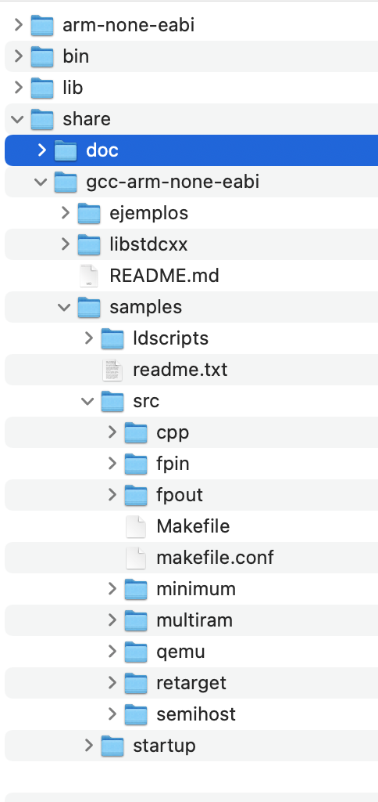
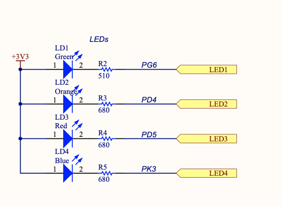

# GNU Arm Embedded Toolchain
El tutorial es como usar gcc-arm-none-eabi para ARM y poder programar director el micro sin IDE de fabricantes.
## Kit usado
- STM32F469 Discovery kit
## Pasos
Los pasos son los siguientes:
- Descargar  de la siguiente pagina https://developer.arm.com/downloads/-/gnu-rm

- Una vez descargado nos vamos al siguiente directorio, el cual tengo agregado la carpeta de ejemplo.

-Luego toca agregar path en la MAC es similar en la consola (export PATH="$PATH:/DIRECTORIO/gcc_arm/gcc-arm-none-eabi-10-2020-q4-major/bin/")
- Toca copiar del repositorio la carpeta ejemplos y ejecutar el makefile (make).

## Codigo de ejemplo
Esta parte revisar del data del MCU, son los registros y el BSP para saber que pin se va usar.<br>
El pin seleccionado es el led rojo que se muestra en la siguiente imagen.



Por esa razon todo esta realizado para el puerto D y IO 5.
```c
#include <stdint.h>

#define AHB1_CLOCK_ER 			(*(volatile uint32_t *)(0x40023830))
#define GPIOD_AHB1_CLOCK_ER 	(1 << 3)

#define GPIOD_BASE 				0x40020c00
#define GPIOD_MODE 				(*(volatile uint32_t *)(GPIOD_BASE + 0x00))
#define GPIOD_OTYPE 			(*(volatile uint32_t *)(GPIOD_BASE + 0x04))
#define GPIOD_OTYPE 			(*(volatile uint32_t *)(GPIOD_BASE + 0x04))
#define GPIOD_PUPD 				(*(volatile uint32_t *)(GPIOD_BASE + 0x0c))
#define GPIOD_ODR  				(*(volatile uint32_t *)(GPIOD_BASE + 0x14))
#define GPIOD_BSRR 				(*(volatile uint32_t *)(GPIOD_BASE + 0x18))
#define LED_PIN 				(5)


void led_setup(void)
{
    uint32_t reg;
    AHB1_CLOCK_ER |= GPIOD_AHB1_CLOCK_ER;
    reg = GPIOD_MODE & ~ (0x03 << (LED_PIN * 2));
    GPIOD_MODE = reg | (1 << (LED_PIN * 2));

    reg = GPIOD_PUPD & (0x03 <<  (LED_PIN * 2));
    GPIOD_PUPD = reg | (0x02 << (LED_PIN * 2));
}

void led_on(void)
{
    GPIOD_BSRR |= (1 << LED_PIN);
}

void led_off(void)
{
    GPIOD_BSRR |= (1 << (LED_PIN + 16));
}

void led_toggle(void)
{
    if ((GPIOD_ODR & (1 << LED_PIN)) == (1 << LED_PIN))
        led_off();
    else
        led_on();
}

void delay(unsigned long milis){
	for(int i=0;i<milis;i++){

	}
}


#ifndef __NO_SYSTEM_INIT
void SystemInit()
{}
#endif

int main()
{
	led_setup();
	while(1){
		led_toggle();
		delay(3000000);
	}
}
```

